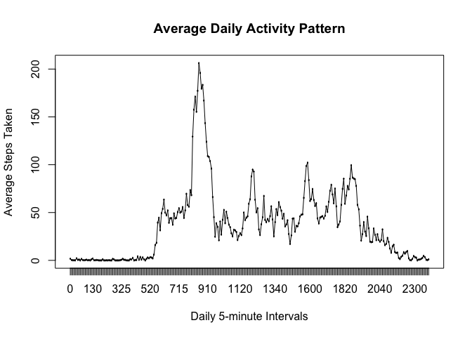

# Reproducible Research: Peer Assessment 1, by Shuai Wang

## Loading and preprocessing the data


```r
raw_data<-read.csv('activity.csv')#load data
head(raw_data,5)#read first five rows
```

```
##   steps       date interval
## 1    NA 2012-10-01        0
## 2    NA 2012-10-01        5
## 3    NA 2012-10-01       10
## 4    NA 2012-10-01       15
## 5    NA 2012-10-01       20
```

```r
summary(raw_data)#get summary
```

```
##      steps                date          interval     
##  Min.   :  0.00   2012-10-01:  288   Min.   :   0.0  
##  1st Qu.:  0.00   2012-10-02:  288   1st Qu.: 588.8  
##  Median :  0.00   2012-10-03:  288   Median :1177.5  
##  Mean   : 37.38   2012-10-04:  288   Mean   :1177.5  
##  3rd Qu.: 12.00   2012-10-05:  288   3rd Qu.:1766.2  
##  Max.   :806.00   2012-10-06:  288   Max.   :2355.0  
##  NA's   :2304     (Other)   :15840
```
## What is mean total number of steps taken per day?
#### solution:  
1. ignore the missing data using na.omit
2. use aggregate() function to sum by date

```r
complete_data<-na.omit(raw_data)#ignore missing data
complete_data$date<-as.Date(complete_data$date)#set data class
complete_data$interval<-as.factor(complete_data$interval)#set interval labels
aggdata <-aggregate(steps~date,complete_data,FUN=sum) # use aggregate() function to sum by date
```
3. Plot the histogram

```r
hist(aggdata$steps, main="Histogram of steps taken per day",xlab="Number of Steps", ylab="Count")
```

<!-- -->
And I can report mean and median:  

```r
print(mean(aggdata$steps))
```

```
## [1] 10766.19
```

```r
print(median(aggdata$steps))
```

```
## [1] 10765
```
## What is the average daily activity pattern?
1. Make a time series plot (i.e. type = "l") of the 5-minute interval (x-axis) and the average number of steps taken, averaged across all days (y-axis)
The idea is to aggregate complete_data by interval fucntion first, this function will give us the average number of steps taken of each 5-minute interval, across all days.  
#### solution:  
The time series plot can be made with plot() and lines() function  

```r
avgIntervalData<-aggregate(steps~interval,complete_data,FUN=mean)
plot(avgIntervalData$interval,avgIntervalData$steps,main="Average Daily Activity Pattern", xlab="Daily 5-minute Intervals",ylab="Average Steps Taken")
lines(avgIntervalData$interval,avgIntervalData$steps)
```

<!-- -->
2. Which 5-minute interval, on average across all the days in the dataset, contains the maximum number of steps?  

#### solution:  
In this question, we want to find the _index_ of which have the highest *steps* value. I use which() function to find it.  

```r
print(avgIntervalData[which.max( avgIntervalData[,2] ),])
```

```
##     interval    steps
## 104      835 206.1698
```

## Imputing missing values
Note that there are a number of days/intervals where there are missing values (coded as NA). The presence of missing days may introduce bias into some
calculations or summaries of the data.
1. Calculate and report the total number of missing values in the dataset
(i.e. the total number of rows with NAs)  

#### solution:  
I use sum() and is.na() to count missing values in the dataset.  

```r
print(sum(is.na(raw_data$steps)))
```

```
## [1] 2304
```
2. Devise a strategy for filling in all of the missing values in the dataset. The strategy does not need to be sophisticated. For example, you could use the mean/median for that day, or the mean for that 5-minute interval, etc.  

#### solution:  
In this problem, I use the mean for 5-minute intervals to fill the data

```r
#myFinder function will find the value in the dataset (avgIntervalData) that contains average steps taken by each interval.
raw_data$interval<-as.factor(raw_data$interval)
myFinder<-function(x){
  if(is.na(x[1])) {# if this row's step value is missing
    tmp<-x[3] # find the interval label  that corresponds to this row
    target<-subset(avgIntervalData,interval == tmp) # find the stepvalue should fill in 
    newRow<-data.frame(c(as.numeric(target['steps']),x[2],x[3])) # create a new record with filled data
    row.names(newRow)<-row.names(x)
    return (newRow)
  } else {
    newRow<-x
    row.names(newRow)<-row.names(x)
    return (newRow)# otherwise make no change
 }
}
newData<-as.data.frame(t(as.data.frame(apply(raw_data,1,myFinder))))# apply my finder function to the raw data
newData$steps<-as.numeric(as.character(newData$steps))# make steps as numeric variable
rownames(newData)<-NULL #clean up the row index names
head(newData,5)#display first 5 rows to check whether missing values are filled
```

```
##       steps       date interval
## 1 1.7169811 2012-10-01        0
## 2 0.3396226 2012-10-01        5
## 3 0.1320755 2012-10-01       10
## 4 0.1509434 2012-10-01       15
## 5 0.0754717 2012-10-01       20
```

```r
summary(newData)#display the summary of new data
```

```
##      steps                date          interval    
##  Min.   :  0.00   2012-10-01:  288   0      :   61  
##  1st Qu.:  0.00   2012-10-02:  288   10     :   61  
##  Median :  0.00   2012-10-03:  288   100    :   61  
##  Mean   : 37.38   2012-10-04:  288   1000   :   61  
##  3rd Qu.: 27.00   2012-10-05:  288   1005   :   61  
##  Max.   :806.00   2012-10-06:  288   1010   :   61  
##                   (Other)   :15840   (Other):17202
```

3. Create a new dataset that is equal to the original dataset but with the missing data filled in. 

#### solution:  
Please see the "newData" dataframe created above.  
### 4. Make a histogram of the total number of steps taken each day and Calculate and report the mean and median total number of steps taken per day. Do these values differ from the estimates from the first part of the assignment? What is the impact of imputing missing data on the estimates of the total daily number of steps?  

#### solution:  
this is similar to question 1. I reuse the same function with new data.  

```r
#this is similar to question 1. We just reuse the same function with new data
aggSimulateData <-aggregate(steps~date,newData,FUN=sum)
hist(aggSimulateData$steps, main="Histogram of steps taken per day",xlab="Number of Steps", ylab="Count")
```

<!-- -->

```r
print(mean(aggSimulateData$steps))
```

```
## [1] 10766.19
```

```r
print(median(aggSimulateData$steps))
```

```
## [1] 10766.19
```
5. Are there differences in activity patterns between weekdays and week- ends?
For this part the weekdays() function may be of some help here. Use the dataset with the filled-in missing values for this part.

1. Create a new factor variable in the dataset with two levels – “weekday” and “weekend” indicating whether a given date is a weekday or weekend day.

#### solution:  

```r
#weekday/weekend finder solution from this thread: #http://stackoverflow.com/questions/26441700/how-to-determine-if-date-is-a-weekend-or-not-not-using-lubridate
library(chron)
newData$wday <-as.factor(is.weekend(newData$date))
levels(newData$wday)<-as.factor(c("weekday","weekend"))
weeklyPattern<-aggregate(steps~interval+wday,newData,FUN=mean)
```
2. Make a panel plot containing a time series plot (i.e. type = "l") of the 5-minute interval (x-axis) and the average number of steps taken, averaged across all weekday days or weekend days (y-axis). The plot should look something like the following, which was creating using simulated data:

## Are there differences in activity patterns between weekdays and weekends?  

#### solution:  
to answer this question, we create panel plot by lattice system.  
*conclusion* From the comparsion, it looks like weekends activity have more steps during the night.

```r
library(lattice) 
xyplot(steps~interval|wday,data=weeklyPattern, type = "l",layout=c(1,2))
```

<!-- -->
